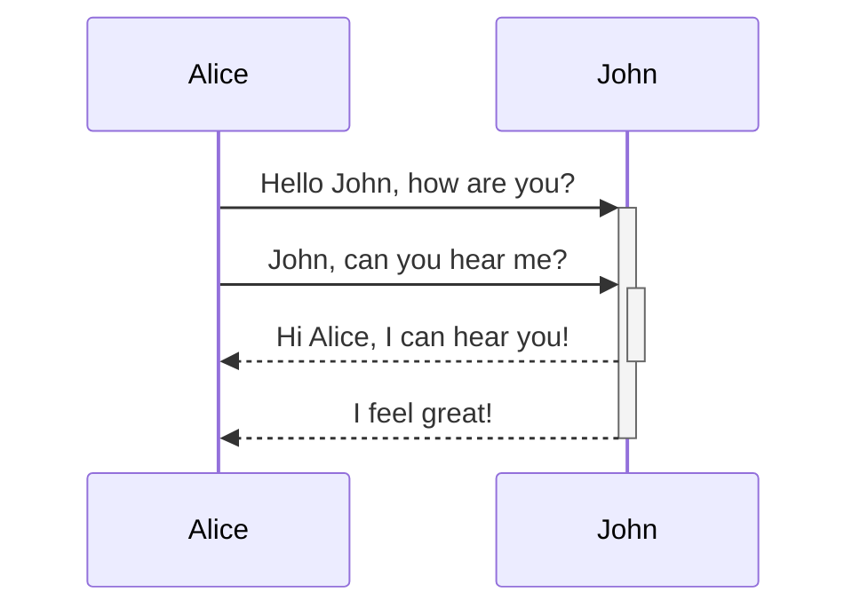

# pandoc-mermaid-chartjs-filter

Pandoc filter for creating diagrams with mermaid, Chart.js or others provided via syntax blocks in markdown docs.

## Installation

```sh
npm install -g pandoc-mermaid-chartjs-filter
```

## Usage

Just run pandoc and declare to use the pandoc-mermaid-chartjs-filter with `---filter chart-filter`.

```sh
pandoc document.md --filter chart-filter -o document.html
```

To create a mermaid diagram, add a fenced code block to the markdown file, assign `mermaid` as the class, and provide the plain mermaid code.

~~~markdown

~~~

To create a Chart.js diagram, add a fenced code block to the markdown file, assign `chartjs` as the class, and provide the options for the chart formatted as YAML.

~~~markdown
```chartjs
type: bar
data:
  labels:
  - Red
  - Blue
  - Yellow
  - Green
  - Purple
  - Orange
  datasets:
  - label: "# of Votes"
    data:
    - 12
    - 19
    - 3
    - 5
    - 2
    - 12
    borderWidth: 1
options:
  scales:
    y:
      beginAtZero: true
```
~~~

### Advanced Usage

The `pandoc-mermaid-chartjs-filter` provides additional options to configure the results.


## LICENSE

MIT License

Copyright (c) 2023 Mark Lubkowitz

Permission is hereby granted, free of charge, to any person obtaining a copy
of this software and associated documentation files (the "Software"), to deal
in the Software without restriction, including without limitation the rights
to use, copy, modify, merge, publish, distribute, sublicense, and/or sell
copies of the Software, and to permit persons to whom the Software is
furnished to do so, subject to the following conditions:

The above copyright notice and this permission notice shall be included in all
copies or substantial portions of the Software.

THE SOFTWARE IS PROVIDED "AS IS", WITHOUT WARRANTY OF ANY KIND, EXPRESS OR
IMPLIED, INCLUDING BUT NOT LIMITED TO THE WARRANTIES OF MERCHANTABILITY,
FITNESS FOR A PARTICULAR PURPOSE AND NONINFRINGEMENT. IN NO EVENT SHALL THE
AUTHORS OR COPYRIGHT HOLDERS BE LIABLE FOR ANY CLAIM, DAMAGES OR OTHER
LIABILITY, WHETHER IN AN ACTION OF CONTRACT, TORT OR OTHERWISE, ARISING FROM,
OUT OF OR IN CONNECTION WITH THE SOFTWARE OR THE USE OR OTHER DEALINGS IN THE
SOFTWARE.
