# Title

A markdown file

```{.mermaid caption="Flowchart from A to B with Callback"}
graph LR;
    A-->B;
    click A callback "Tooltip for a callback"
    click B "http://www.github.com" "This is a tooltip for a link"
```




```mermaid
%%{init: {"quadrantChart": {"chartWidth": 400, "chartHeight": 400}, "themeVariables": {"quadrant1TextFill": "#ff0000"} }}%%
quadrantChart
  x-axis Urgent --> Not Urgent
  y-axis Not Important --> "Important ❤"
  quadrant-1 Plan
  quadrant-2 Do
  quadrant-3 Delegate
  quadrant-4 Delete
```

## Chartjs

```chartjs
type: bar
data:
  labels:
  - Red
  - Blue
  - Yellow
  - Green
  - Purple
  - Orange
  datasets:
  - label: "# of Votes"
    data:
    - 12
    - 19
    - 3
    - 5
    - 2
    - 12
    borderWidth: 1
options:
  scales:
    y:
      beginAtZero: true
```